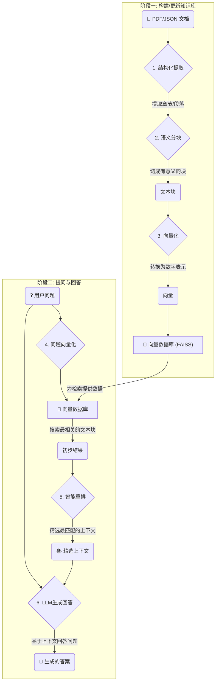

# PaperPilot: 你的本地智能文档问答系统

**PaperPilot** 是一个基于检索增强生成 (RAG) 技术的本地知识库问答系统。它能将你的个人文档（如PDF论文、报告、书籍）转化为一个智能的、可对话的知识库，让你通过自然语言提问，获得精准、忠于原文的回答。

[](https://www.python.org/downloads/release/python-3120/)

---

## 核心功能

*   **🚀 高质量检索**: 采用先进的 **“结构化提取 -> 语义分块 -> 检索 -> 重排”** 流程，确保为大语言模型（LLM）提供最相关的上下文，显著提升回答的准确性。
*   **🔁 增量更新**: 支持向知识库中动态添加新文档，系统会自动处理并更新索引，无需每次都从头构建，高效省时。
*   **🧩 模块化设计**: 清晰的代码结构，将数据提取、向量化、检索、LLM调用等功能解耦，易于理解、维护和扩展。
*   **⚙️ 灵活配置**: 支持切换不同的嵌入模型、重排模型和大型语言模型（包括OpenAI API及本地Ollama模型），满足不同场景的需求。
*   **💬 交互式界面**: 内置一个简单易用的命令行工具，方便用户进行文档管理、提问和系统状态监控。

## 工作流程

PaperPilot 的工作流程分为两个核心阶段：知识库构建和问答查询。




## 项目结构

```
rag_PaperPilot/
├── chunking/               # 1. 数据处理与分块
│   ├── extractor.py        # - 从PDF/JSON中提取结构化文本
│   └── embedder.py         # - 将文本块向量化
├── llm/                    # 2. 大语言模型
│   └── llm_client.py       # - 与LLM API交互 (OpenAI, Ollama等)
├── vector_store/           # 3. 向量存储与检索
│   ├── build_index.py      # - 构建并保存FAISS向量索引
│   └── retriever.py        # - 实现检索、重排逻辑
├── config.py               # 4. 全局配置文件
├── rag.py                  # 5. RAG系统主入口和交互界面
└── README.md               # 项目说明
```

1.  **`chunking`**: 负责知识库的“消化”过程。它从原始文档中提取文本，并将其智能地分割成有意义的知识块，然后进行向量化。
2.  **`llm`**: 负责与大语言模型的大脑进行通信，将处理好的上下文和用户问题发送给LLM，并获取最终答案。
3.  **`vector_store`**: 项目的“记忆中枢”。它使用FAISS构建高效的向量索引，并负责根据用户问题快速、准确地检索相关信息，同时通过重排模型优中选优。
4.  **`config.py`**: 系统的“控制面板”，你可以在这里调整所有关键参数，如模型名称、API密钥、文件路径等。
5.  **`rag.py`**: 系统的“总指挥”，它整合了所有模块，提供了知识库构建、增量更新和交互式问答的完整逻辑。

## 快速开始

### 1. 环境准备

克隆本项目并安装所需的依赖库：

```bash
git clone https://github.com/your-username/rag_PaperPilot.git
cd rag_PaperPilot
pip install -r requirements.txt 
```
*(注意: `requirements.txt` 文件需要您根据 `import` 语句自行创建)*

### 2. 配置模型

打开 [`config.py`](rag_PaperPilot/config.py) 文件，根据你的需求进行配置：

*   **LLM配置**: 在 `LLMConfig` 中设置 `LLM_TYPE` (如 "openai"), `MODEL_NAME`, `API_KEY` 和 `API_BASE`。
*   **嵌入模型配置**: 在 `EmbeddingConfig` 中设置 `EMBEDDING_MODEL` 和相关的API密钥（如果需要）。
*   **文档路径**: 在 `RAGConfig` 中修改 `PDF_DIR`，指向你存放文档的目录。

### 3. 运行系统

将你的 `.json` 格式的结构化文档放入你在 `PDF_DIR` 中配置的目录，然后运行主程序：

```bash
python rag.py
```

系统启动后，会检查是否存在已构建的知识库。如果检测到新文档，它会提示你是否立即构建。

### 4. 开始问答

知识库构建完成后，你就可以在交互式界面中开始提问了！

```
=== 增强RAG文档问答系统 ===
可用命令:
  正常问题: 直接输入问题进行查询
  'add': 添加新的PDF文档
  'stats': 查看文档库统计信息
  'config': 查看当前配置
  'rebuild': 重新构建整个知识库
  'quit': 退出系统
--------------------------------------------------

您的输入: 这篇论文的核心贡献是什么？
